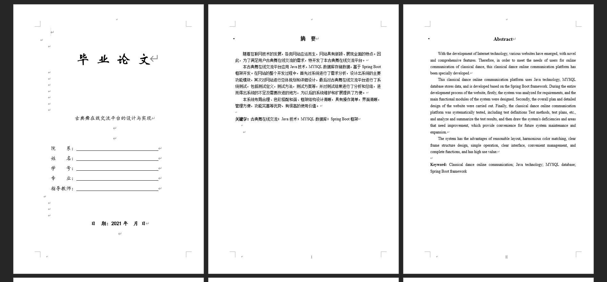
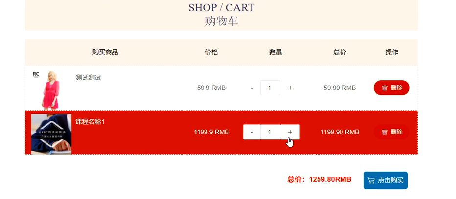
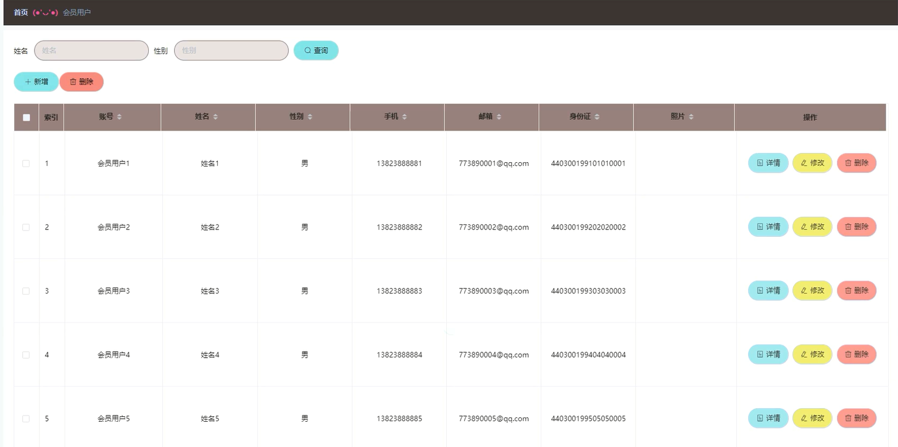
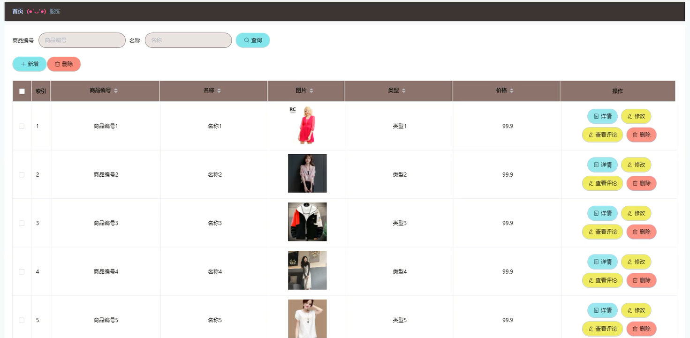
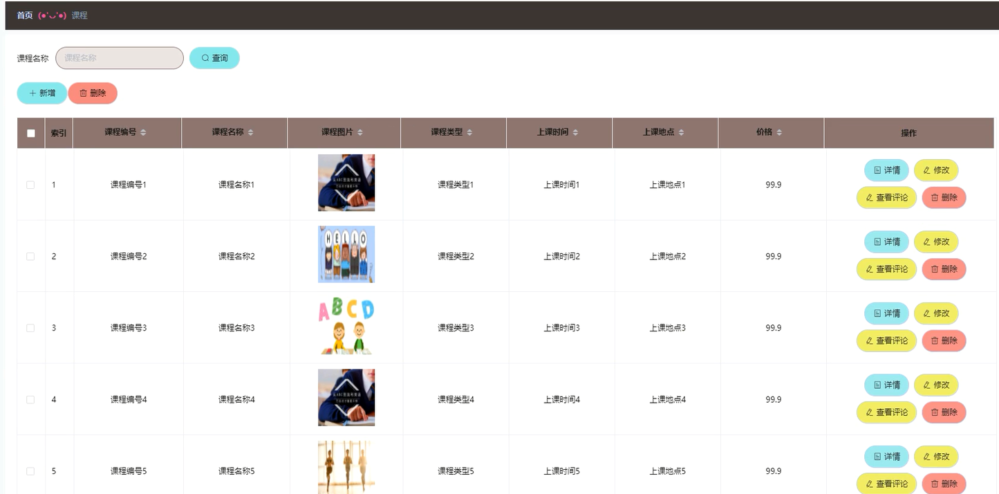

基于Springboot的古典舞在线交流平台（程序+论文）
=
### 完整代码获取地址：从戎源码网 ([https://armycodes.com/](https://armycodes.com/))
### 作者微信：19941326836  QQ：952045282 
### 承接计算机毕业设计、Java毕业设计、Python毕业设计、深度学习、机器学习
### 选题+开题报告+任务书+程序定制+安装调试+论文+答辩ppt 一条龙服务
### 所有选题地址https://github.com/nature924/allProject

一、项目介绍
---
系统包含两种角色：用户、管理员，系统分为前台和后台两大模块，主要功能如下：

### 1 用户功能模块的实现

- 系统主界面: 用户进入系统后可以查看首页、服饰、课程、视频和论坛交流等内容。

- 用户注册界面: 新用户可以通过该界面进行注册操作。

- 论坛交流界面: 用户可以在论坛交流界面查看已有的交流信息，并选择查看详情。

- 课程详情界面: 用户可以查看课程的详细信息，登录后可以将课程加入购物车或进行购买操作。

- 购物车界面: 用户可以在购物车界面查看和管理购物车中的商品，包括修改数量、删除商品或提交订单。

- 我的订单界面: 用户可以查看个人订单的信息。

### 2 管理员功能模块的实现

- 管理员登录界面: 管理员必须通过该界面登录系统后台以进行管理操作。

- 会员用户管理界面: 管理员可以对会员用户的信息进行增删改查操作。

- 服饰管理界面: 管理员可以对服饰信息进行增删改查操作。

- 课程管理界面: 管理员可以对课程信息进行增删改查操作。

二、项目技术
---
- 编程语言：Java
- 数据库：MySQL
- 项目管理工具：Maven
- 前端技术：VUE、HTML、Jquery、Bootstrap
- 后端技术：Spring、SpringMVC、MyBatis

三、运行环境
---
- 操作系统：Windows、macOS都可以
- JDK版本：JDK1.8以上都可以
- 开发工具：IDEA、Ecplise、Myecplise都可以
- 数据库: MySQL5.7以上都可以
- Tomcat：任意版本都可以
- Maven：任意版本都可以

四、运行截图
---
### 论文截图：

### 程序截图：

